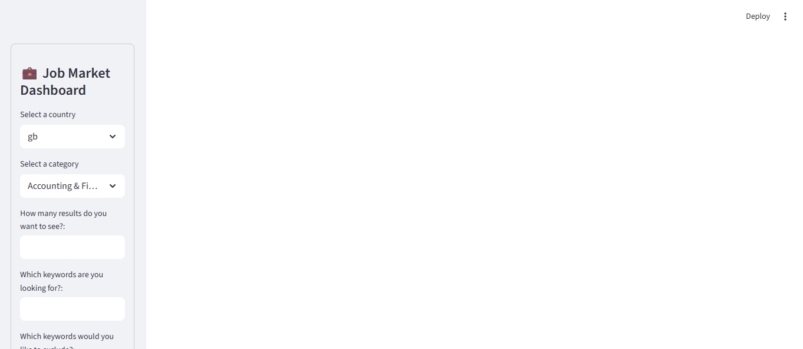
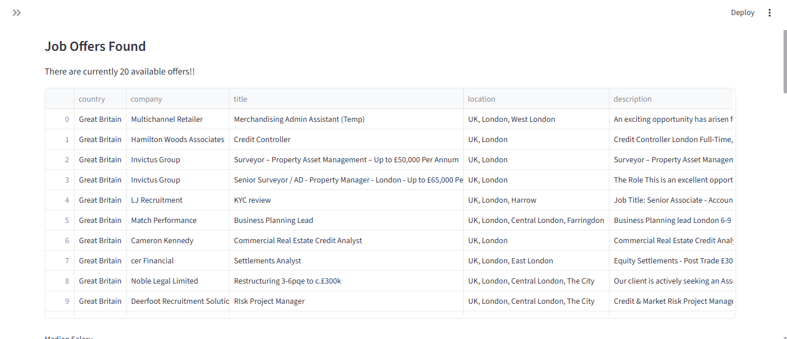
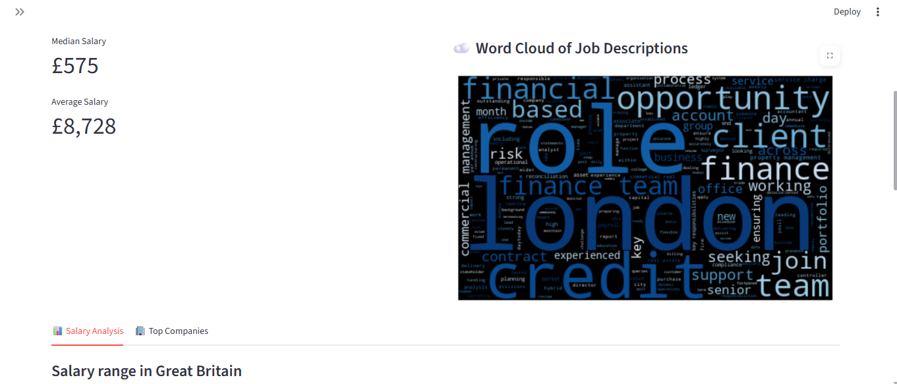
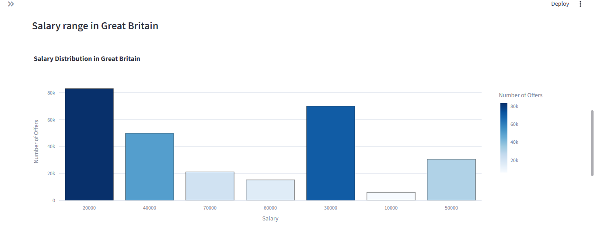
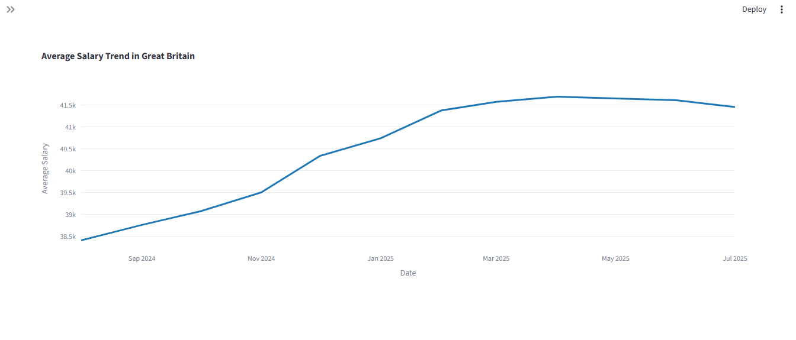
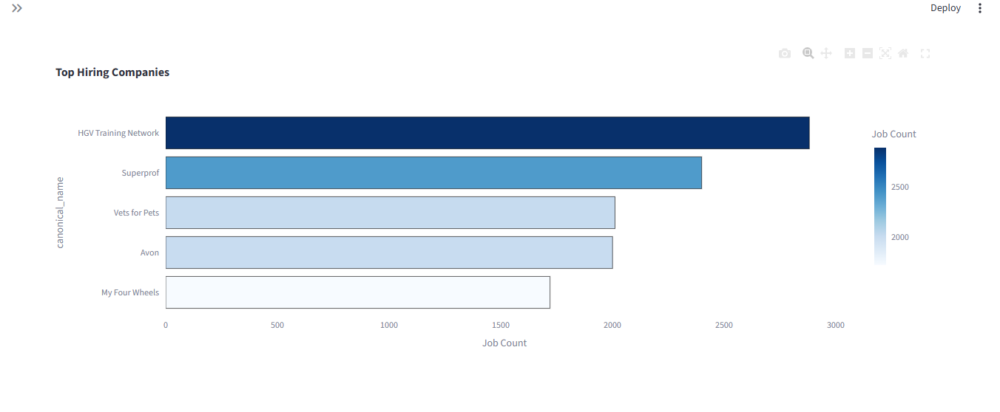

# 💼 Job Market Dashboard

An interactive Streamlit web app that uses the [Adzuna Jobs API](https://developer.adzuna.com/overview) to explore job offers by salary, location, keywords, and company.  
It provides salary insights, hiring trends, and keyword analysis in a clean, visual format.

---

## ✨ Features

- **Advanced Filtering**  
  Search by:
  - Country  
  - Job category  
  - Keywords to include/exclude  
  - Location  
  - Salary range  
  - Offer posting date  
  - Full-time / part-time  

- **Visual Insights**  
  - Salary distribution histogram  
  - Salary trends over time  
  - Word cloud from job descriptions  
  - Top hiring companies  

- **Robust Error Handling**  
  - Handles API errors gracefully  
  - Validates user inputs to prevent crashes  

---

## 🛠️ Installation

1. **Clone the repository**  
   ~~~bash
   git clone https://github.com/<your-username>/<your-repo>.git
   cd <your-repo>
   ~~~

2. **Create and activate a virtual environment** (recommended)  
   ~~~bash
   python -m venv venv
   source venv/bin/activate   # Mac/Linux
   venv\Scripts\activate      # Windows
   ~~~

3. **Install dependencies**  
   ~~~bash
   pip install -r requirements.txt
   ~~~

4. **Download NLTK data** (needed for stopwords & tokenization)  
   ~~~bash
   python -m nltk.downloader punkt
   python -m nltk.downloader stopwords
   ~~~

---

## 🔑 API Setup

1. **Get your Adzuna API keys** from:  
   https://developer.adzuna.com/

2. **Create a `.env` file** in the project root:  
   ~~~env
   ADZUNA_APP_ID=your_app_id_here
   ADZUNA_APP_KEY=your_app_key_here
   ~~~

## 🚀 Usage

Run the app with:  
~~~bash
streamlit run main.py
~~~

The dashboard will open in your browser!

--- 

## Website screenshots (example)

